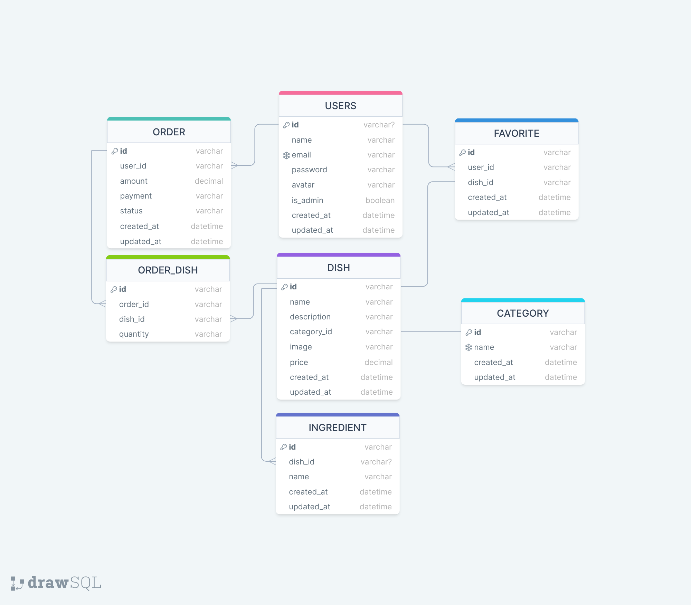

# Food Explorer - Backend

* Esse projeto é um cardápio digital para um restaurante fictício, conhecido como foodExplorer.


# 📝Sobre

Este é backend do Desafio Final do programa Explorer da Rocketseat.

Essa aplicação simula um restaurante fictício, conhecido como foodExplorer, aonde usuários podem se cadastrar e logar.

Sendo o usuário um Administrador, ele poderá adicionar pratos, ingredients, atualizar pedidos, etc.

Sendo o usuário um Cliente, ele poderá atualizar o perfil, fazer um pedido, adicionar um produto as favoritos, etc.

Abaixo, temos a modelagem do banco de dados:



# 📝Tecnologias

* JS - usado para fazer toda a lógica da aplicação;
* NodeJs - utilizado para executar o JS fora do navegador;
* Express - responsável por lidar com as requisições HTTP;
* Jest - utilizado para realizar testes de integração;
* Sqlite - usado para armazenar os dados;
* Knex - utilizado para gerar comandos SQL;
* Multe - usado para gerenciar o upload de imagens.
* Git - responsável por realizar o versionamento do código.

# 🔨Funcionalidades

* Cadastrar um usuário;
* Atualizar e-mail, senha, ou nome de um usuário.
* Mostrar informações de um pedido especifico;
* Mostrar todos os pedidos de um usuário ou de todos os usuários.
* Cadastrar, atualizar, mostrar ou deletar um prato.
* Cadastrar, ou mostrar um ingrediente.
* Criar, atualizar, mostrar informações de um pedido.

# 💡Utilização

#### Clone o projeto:
```` 
git clone https:https://github.com/matheusvieira14/food_explorer-Backend_js.git 
````

#### Entre no diretório:
```` 
$cd food_explorer-Backend_js 
````

#### Instale as dependências:
```` 
$npm install 
````

#### Inicie o servidor local:
````
$npm run dev 
````
````
$npm run migrate
````
````
$npm run seed 
````
#### Se tudo der certo, a seguinte mensagem vai aparecer no terminal/console:
``` Server is running on port 3333. ```

# Autor
Feito por Dev Matheus da Rocha Vieira 😀 Veja meu [LinkedIn](https://www.linkedin.com/in/matheus-vieira-001b46248/).
